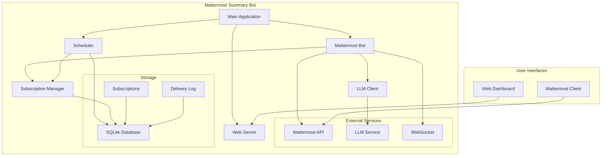

# 🤖 Mattermost Summary Bot

Интеллектуальный бот для Mattermost с поддержкой автоматических подписок на сводки каналов и AI-генерацией контента.

## 📋 Содержание

- [Возможности](#-возможности)
- [Архитектура](#-архитектура)
- [Быстрый старт](#-быстрый-старт)
- [Конфигурация](#-конфигурация)
- [Использование](#-использование)
- [API документация](#-api-документация)
- [Развертывание](#-развертывание)
- [Разработка](#-разработка)
- [Лицензия](#-лицензия)

## ✨ Возможности

### 🎯 Основные функции
- **📊 Сводки каналов** - генерация структурированных сводок активности в каналах
- **🧵 Саммари тредов** - анализ и краткое изложение обсуждений
- **📅 Автоматические подписки** - регулярные сводки по расписанию
- **🌍 Часовые пояса** - автоматическое определение и поддержка временных зон
- **🔍 Поиск по каналам** - поиск сообщений и контента в каналах
- **🌐 Веб-интерфейс** - мониторинг и управление через веб-панель

### 🚀 Технические особенности
- **⚡ Асинхронная архитектура** - высокая производительность и отзывчивость
- **🔄 Планировщик подписок** - автоматическое выполнение задач по расписанию
- **🛡️ Безопасность** - проверка прав доступа и валидация данных
- **📝 Подробное логирование** - полная трассировка работы системы
- **🔌 WebSocket интеграция** - реальное время получения событий

## 🏗️ Архитектура



### 🧩 Компоненты

| Компонент | Назначение | Технологии |
|-----------|------------|------------|
| **MattermostBot** | Основная логика бота, обработка команд | WebSocket, HTTP API |
| **SubscriptionManager** | Управление подписками и расписаниями | SQLite, pytz |
| **LLMClient** | Взаимодействие с AI сервисом | HTTP API, JSON |
| **Scheduler** | Планировщик автоматических задач | asyncio, cron-like |
| **WebServer** | Веб-интерфейс и API | FastAPI, Uvicorn |

## 🚀 Быстрый старт

### Предварительные требования

- Python 3.9+
- Mattermost сервер
- Доступ к LLM API

### Установка

```bash
# Клонируем репозиторий
git clone https://github.com/your-username/mattermost-summary-bot.git
cd mattermost-summary-bot

# Создаем виртуальное окружение
python -m venv venv

# Активируем виртуальное окружение
# Linux/Mac:
source venv/bin/activate
# Windows:
venv\Scripts\activate

# Устанавливаем зависимости
pip install -r requirements.txt

# Копируем файл конфигурации
cp env.example .env

# Редактируем конфигурацию
nano .env
```

### Конфигурация

Отредактируйте файл `.env`:

```env
# Mattermost конфигурация
MATTERMOST_URL=https://your-mattermost-instance.com
MATTERMOST_TOKEN=your-bot-token
MATTERMOST_BOT_USERNAME=summary-bot

# LLM конфигурация
LLM_PROXY_TOKEN=your-llm-token
LLM_BASE_URL=https://your-llm-service.com
LLM_MODEL=qwen3:14b

# Общие настройки
BOT_PORT=8080
LOG_LEVEL=INFO
DEBUG=false
```

### Запуск

```bash
# Запуск с помощью скрипта
./start.sh

# Или напрямую
python main.py
```

## ⚙️ Конфигурация

### Переменные окружения

| Переменная | Описание | По умолчанию |
|------------|----------|--------------|
| `MATTERMOST_URL` | URL Mattermost сервера | обязательно |
| `MATTERMOST_TOKEN` | Токен бота | обязательно |
| `MATTERMOST_BOT_USERNAME` | Имя пользователя бота | summary-bot |
| `LLM_PROXY_TOKEN` | Токен LLM сервиса | обязательно |
| `LLM_BASE_URL` | URL LLM API | обязательно |
| `LLM_MODEL` | Модель LLM | qwen3:14b |
| `BOT_PORT` | Порт веб-сервера | 8080 |
| `LOG_LEVEL` | Уровень логирования | INFO |
| `DEBUG` | Режим отладки | false |

### Создание бота в Mattermost

1. Войдите в Mattermost как администратор
2. Перейдите в **System Console** → **Integrations** → **Bot Accounts**
3. Включите **Enable Bot Account Creation**
4. Создайте нового бота:
   - Username: `summary-bot`
   - Display Name: `Summary Bot`
   - Description: `AI-powered summary bot`
5. Скопируйте токен и добавьте в `.env`

## 📖 Использование

### Команды в каналах

#### Саммари тредов
```
!summary                    # Саммари текущего треда
summary                     # Альтернативная команда  
саммари                     # Русская команда
@summary-bot [ID треда]     # Саммари конкретного треда по ID
```

#### Сводка канала
```
@summary-bot канал за 24 часа    # Саммари канала за день
@summary-bot канал за неделю     # Саммари канала за неделю
@summary-bot канал за 3 часа     # Саммари канала за N часов
```

#### Поиск
```
@summary-bot найди [запрос] в канале    # Поиск по сообщениям канала
```

#### Справка
```
@summary-bot                            # Показать доступные команды
@summary-bot help                       # Справка по командам
```

### Подписки (в личных сообщениях)

#### Создание подписки
```
~канал1, ~канал2 ежедневно в 9 утра
~канал1, ~канал2 еженедельно по вторникам в 18:00
~канал1 каждую среду в 6 вечера
~канал1 пятница 17:30
```

#### Управление подписками
```
подписки              # Показать активные подписки
мои подписки          # Альтернативный вариант
удалить подписку      # Удалить все подписки
создать подписку      # Получить инструкцию
```

### Форматы времени

#### Периодичность
- `ежедневно` или `каждый день`
- `еженедельно` или `каждую неделю`
- `каждую среду` или `каждый понедельник`
- Просто `вторник`, `среда`, `пятница`

#### Время
- `в 9 утра` или `в 09:00`
- `в 18:00` или `в 6 вечера`
- `в 15:30` или просто `18:00`

#### Дни недели
- `по понедельникам`, `по вторникам`, `по средам`
- `по четвергам`, `по пятницам`, `по субботам`, `по воскресеньям`
- `каждую среду`, `каждый понедельник`

### Часовые пояса

- **По умолчанию**: `Europe/Moscow`
- **Автоопределение**: Система автоматически определяет часовой пояс пользователя из настроек Mattermost
- **Поддержка**: Все стандартные часовые пояса pytz

## 🌐 API документация

### Веб-интерфейс

Доступен по адресу: `http://localhost:8080`

#### Эндпоинты

| Метод | Путь | Описание |
|-------|------|----------|
| `GET` | `/` | Главная страница с информацией о боте |
| `GET` | `/health` | Проверка состояния бота |
| `GET` | `/stats` | Статистика использования |
| `GET` | `/subscriptions` | Список всех подписок |

### Примеры запросов

#### Проверка здоровья
```bash
curl http://localhost:8080/health
```

#### Получение статистики
```bash
curl http://localhost:8080/stats
```

#### Список подписок
```bash
curl http://localhost:8080/subscriptions
```

## 🚢 Развертывание

### Docker (рекомендуется)

```dockerfile
FROM python:3.11-slim

WORKDIR /app

COPY requirements.txt .
RUN pip install --no-cache-dir -r requirements.txt

COPY . .

EXPOSE 8080

CMD ["python", "main.py"]
```

```bash
# Сборка образа
docker build -t mattermost-summary-bot .

# Запуск контейнера
docker run -d \
  --name summary-bot \
  -p 8080:8080 \
  --env-file .env \
  mattermost-summary-bot
```

### Docker Compose

```yaml
version: '3.8'

services:
  summary-bot:
    build: .
    ports:
      - "8080:8080"
    env_file:
      - .env
    volumes:
      - ./data:/app/data
    restart: unless-stopped
```

### Systemd Service

```ini
[Unit]
Description=Mattermost Summary Bot
After=network.target

[Service]
Type=simple
User=summary-bot
WorkingDirectory=/opt/mattermost-summary-bot
ExecStart=/opt/mattermost-summary-bot/venv/bin/python main.py
Restart=always
RestartSec=10
Environment=PYTHONPATH=/opt/mattermost-summary-bot

[Install]
WantedBy=multi-user.target
```

### Nginx Reverse Proxy

```nginx
server {
    listen 80;
    server_name your-domain.com;
    
    location / {
        proxy_pass http://localhost:8080;
        proxy_set_header Host $host;
        proxy_set_header X-Real-IP $remote_addr;
        proxy_set_header X-Forwarded-For $proxy_add_x_forwarded_for;
        proxy_set_header X-Forwarded-Proto $scheme;
    }
}
```

## 🛠️ Разработка

### Структура проекта

```
mattermost-summary-bot/
├── main.py                 # Точка входа приложения
├── config.py              # Конфигурация
├── mattermost_bot.py      # Основная логика бота
├── llm_client.py          # Клиент для LLM API
├── subscription_manager.py # Управление подписками
├── scheduler.py           # Планировщик задач
├── web_server.py          # Веб-сервер и API
├── requirements.txt       # Зависимости Python
├── env.example           # Пример конфигурации
├── start.sh              # Скрипт запуска
├── docs/                 # Документация
│   ├── QUICKSTART.md
│   ├── SUBSCRIPTIONS.md
│   ├── EXAMPLES.md
│   └── TROUBLESHOOTING.md
└── README.md             # Этот файл
```

### Зависимости

```txt
fastapi>=0.100.0         # Веб-фреймворк
uvicorn>=0.23.0          # ASGI сервер
requests>=2.31.0         # HTTP клиент
websockets>=11.0.0       # WebSocket поддержка
python-dotenv>=1.0.0     # Конфигурация из .env
pytz>=2023.3            # Часовые пояса
```

### Локальная разработка

```bash
# Установка зависимостей для разработки
pip install -r requirements.txt

# Запуск тестов
python -m pytest tests/

# Форматирование кода
python -m black .
python -m isort .

# Линтинг
python -m flake8 .
```

### Контрибуция

1. Форкните репозиторий
2. Создайте ветку для фичи (`git checkout -b feature/amazing-feature`)
3. Зафиксируйте изменения (`git commit -m 'Add amazing feature'`)
4. Отправьте в ветку (`git push origin feature/amazing-feature`)
5. Создайте Pull Request

## 📊 Мониторинг

### Логирование

Бот использует структурированное логирование:

```python
logger.info("🚀 Запуск Mattermost Summary Bot...")
logger.error("❌ Ошибка подключения к Mattermost")
logger.warning("⚠️ Канал не найден")
```

### Метрики

- Количество обработанных сообщений
- Время отклика LLM
- Статистика подписок
- Ошибки подключения

### Здоровье системы

Проверка через веб-интерфейс:
- Статус подключения к Mattermost
- Статус LLM сервиса
- Статус планировщика
- Статус базы данных

## 🔧 Устранение неполадок

### Частые проблемы

#### Бот не отвечает на сообщения
1. Проверьте токен бота в `.env`
2. Убедитесь, что бот добавлен в канал
3. Проверьте логи на ошибки WebSocket

#### Подписки не работают
1. Проверьте часовой пояс пользователя
2. Убедитесь, что планировщик запущен
3. Проверьте права доступа к каналам

#### Ошибки LLM
1. Проверьте токен LLM сервиса
2. Убедитесь в доступности API
3. Проверьте формат запросов

### Отладка

```bash
# Запуск в режиме отладки
DEBUG=true python main.py

# Подробные логи
LOG_LEVEL=DEBUG python main.py
```

## 📄 Лицензия

MIT License - см. файл [LICENSE](LICENSE)

## 👥 Команда

- **Разработчик**: [Your Name]
- **Поддержка**: [support@example.com]

## 🤝 Поддержка

- 📧 Email: [support@example.com]
- 💬 Mattermost: `@summary-bot`
- 🐛 Issues: [GitHub Issues](https://github.com/your-username/mattermost-summary-bot/issues)

---

**Сделано с ❤️ для команд, использующих Mattermost** 