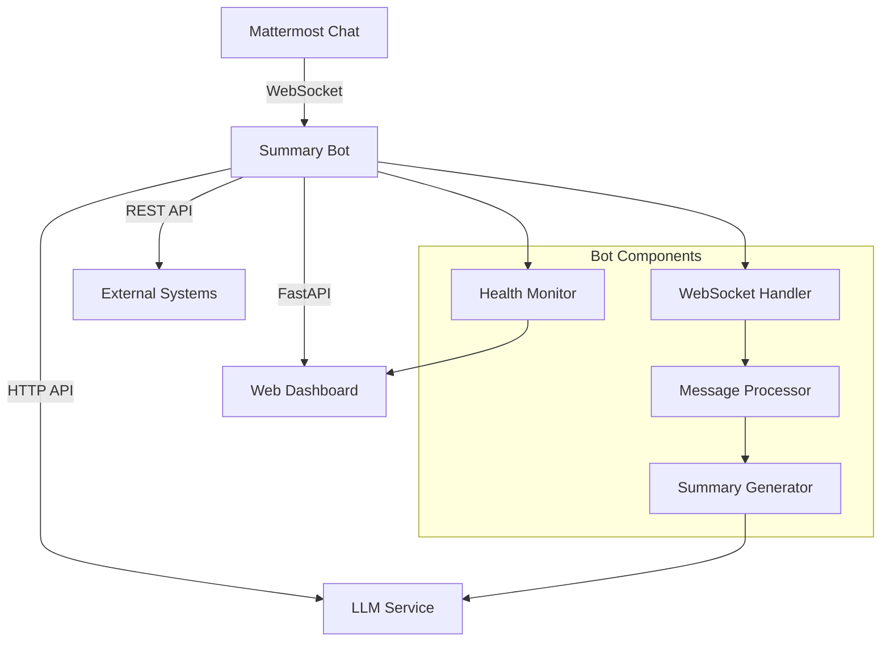

# 🤖 Mattermost Summary Bot v2.0

Умный бот для автоматического создания саммари тредов в Mattermost с использованием корпоративной LLM.

## ✨ Особенности v2.0

- 🔄 **WebSocket соединение в реальном времени** - мгновенная реакция на команды
- 🎯 **Надежная архитектура** - основанная на лучших практиках Mattermost ботов  
- 💬 **Прямые HTTP запросы** - избегание проблем с mattermostdriver
- 🌐 **Улучшенный веб-интерфейс** - современный дашборд для мониторинга
- 🛠️ **REST API** - полноценное API для интеграции и мониторинга
- 🔧 **Автопереподключение** - устойчивость к сбоям сети
- 📊 **Метрики Prometheus** - готовность к продакшену

## 🚀 Функциональность

### Основные возможности
- Создание структурированных саммари тредов по команде `/summary`
- Анализ обсуждений с выделением ключевых моментов, участников и задач
- Поддержка различных команд: `/summary`, `!summary`, `саммари`
- Веб-интерфейс для мониторинга состояния бота
- REST API для интеграции с внешними системами

### Формат саммари
Бот создает структурированные саммари, включающие:
- 👥 **Участники обсуждения**
- 💬 **Основные темы**  
- 📋 **Ключевые моменты**
- ✅ **Задачи и действия**
- 🎯 **Выводы и итоги**

## 🏗️ Архитектура



## 🛠️ Установка и настройка

### 1. Клонирование репозитория
```bash
git clone <repository-url>
cd summary_bot
```

### 2. Создание виртуального окружения
```bash
python -m venv venv
source venv/bin/activate  # Linux/Mac
# или
venv\Scripts\activate     # Windows
```

### 3. Установка зависимостей
```bash
pip install -r requirements.txt
```

### 4. Настройка конфигурации

Создайте файл `.env` на основе `env.example`:

```bash
cp env.example .env
```

Отредактируйте `.env`:

```bash
# Mattermost настройки
MATTERMOST_URL=https://your-mattermost-server.com
MATTERMOST_TOKEN=your-bot-token-here

# LLM настройки (корпоративная LLM)
LLM_PROXY_TOKEN=8d10b6d4-2e40-42fc-a66a-c9c6bf20c92c
LLM_BASE_URL=https://llm.1bitai.ru
LLM_MODEL=qwen3:14b

# Настройки бота
BOT_PORT=8080
LOG_LEVEL=INFO
DEBUG=false
```

### 5. Создание бота в Mattermost

1. Войдите в Mattermost как администратор
2. Перейдите в **System Console → Integrations → Bot Accounts**
3. Нажмите **Add Bot Account**
4. Заполните форму:
   - **Username**: `summary-bot`
   - **Display Name**: `Summary Bot`
   - **Description**: `Бот для создания саммари тредов`
5. Сохраните **Access Token** в `.env` файл

## 🏃‍♂️ Запуск

### Основной запуск
```bash
python main.py
```

После запуска:
- 🌐 **Веб-интерфейс**: http://localhost:8080
- 📊 **Статус**: http://localhost:8080/status  
- ❤️ **Health Check**: http://localhost:8080/health
- 📚 **API Документация**: http://localhost:8080/docs

## 💬 Использование

### 1. Добавление бота в канал
```
/invite @summary-bot
```

### 2. Создание саммари
В любом треде напишите одну из команд:
- `/summary`
- `!summary`
- `summary`
- `саммари` 
- `/саммари`

### 3. Получение результата
Бот создаст структурированное саммари треда с анализом обсуждения.

## 🔧 API Эндпоинты

| Эндпоинт | Метод | Описание |
|----------|-------|----------|
| `/` | GET | Веб-дашборд |
| `/health` | GET | Проверка здоровья |
| `/status` | GET | Подробный статус |
| `/info` | GET | Информация о боте |
| `/metrics` | GET | Метрики Prometheus |
| `/docs` | GET | API документация |

### Примеры запросов

#### Проверка здоровья
```bash
curl http://localhost:8080/health
```

#### Статус компонентов
```bash
curl http://localhost:8080/status
```

#### Метрики для мониторинга
```bash
curl http://localhost:8080/metrics
```

## 🔍 Мониторинг и диагностика

### Логи
```bash
# Просмотр логов
tail -f bot.log

# Мониторинг в реальном времени
python main.py
```

### Статус компонентов
- ✅ **Mattermost**: подключение к серверу
- ✅ **WebSocket**: реальное время соединение  
- ✅ **LLM**: доступность AI сервиса
- ✅ **Bot**: состояние основного процесса

### Диагностика проблем

#### WebSocket не подключается
1. Проверьте URL и токен Mattermost в `.env`
2. Убедитесь в доступности сервера
3. Проверьте сетевую связность

#### LLM недоступен
1. Обновите `LLM_PROXY_TOKEN` в `.env`
2. Проверьте доступность https://llm.1bitai.ru
3. Проверьте корпоративные сетевые настройки

#### Бот не отвечает на команды
1. Убедитесь что бот добавлен в канал
2. Проверьте права доступа бота
3. Попробуйте разные варианты команд

## 🔧 Разработка

### Тестирование конфигурации
```bash
python config.py
```

### Структура проекта
```
summary_bot/
├── main.py              # Основная точка входа
├── mattermost_bot.py    # WebSocket бот (v2.0)
├── config.py           # Управление конфигурацией
├── llm_client.py       # LLM интеграция
├── web_server.py       # FastAPI веб-сервер
├── requirements.txt    # Python зависимости
├── env.example        # Пример конфигурации
└── README.md          # Документация
```

### Ключевые улучшения v2.0

1. **WebSocket вместо HTTP polling** - мгновенная реакция
2. **Прямые HTTP запросы** - избежание проблем парсинга URL  
3. **Улучшенная обработка ошибок** - автопереподключение
4. **Современный веб-интерфейс** - адаптивный дизайн
5. **Расширенное API** - готовность к интеграции
6. **Метрики мониторинга** - продакшен ready

## 🚀 Деплой в продакшен

### Systemd сервис
```bash
# Создание сервиса
sudo nano /etc/systemd/system/summary-bot.service

# Содержимое файла:
[Unit]
Description=Mattermost Summary Bot
After=network.target

[Service]
Type=simple
User=summary-bot
WorkingDirectory=/opt/summary-bot
Environment=PATH=/opt/summary-bot/venv/bin
ExecStart=/opt/summary-bot/venv/bin/python main.py
Restart=always

[Install]
WantedBy=multi-user.target

# Активация
sudo systemctl daemon-reload
sudo systemctl enable summary-bot
sudo systemctl start summary-bot
```

### Nginx прокси (опционально)
```nginx
server {
    listen 80;
    server_name summary-bot.yourdomain.com;
    
    location / {
        proxy_pass http://localhost:8080;
        proxy_set_header Host $host;
        proxy_set_header X-Real-IP $remote_addr;
    }
}
```

## 📋 Требования

- Python 3.8+
- Mattermost Server 5.0+
- Доступ к корпоративной LLM
- Токен бота Mattermost

## 📄 Лицензия

MIT License

## 🤝 Поддержка

При возникновении проблем:

1. Проверьте статус на веб-дашборде
2. Изучите логи приложения
3. Убедитесь в правильности конфигурации
4. Проверьте сетевую доступность сервисов

---

**v2.0** - Полностью переработанная архитектура с WebSocket, улучшенной надежностью и современным интерфейсом. 