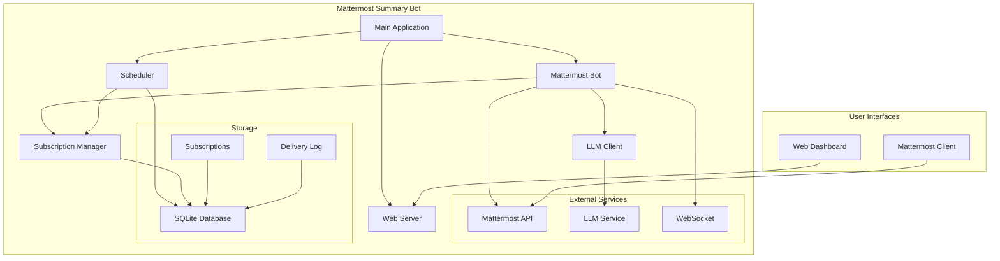

# 🤖 Mattermost Summary Bot

[](https://github.com/chastnik/mm_bot_summary/actions/workflows/ci.yml)
[](https://www.python.org/)

AI-powered Mattermost bot with automatic channel summary subscriptions and AI-generated content.

## 📋 Contents

- [Features](#-features)
- [Architecture](#-architecture)
- [Quick Start](#-quick-start)
- [Configuration](#-configuration)
- [Usage](#-usage)
- [API Documentation](#-api-documentation)
- [Deployment](#-deployment)
- [License](#-license)

## ✨ Features

### 🎯 Core capabilities
- **📊 Channel summaries** - generate structured summaries of channel activity
- **🧵 Thread summaries** - analyze and summarize discussions
- **📅 Automatic subscriptions** - scheduled recurring summaries
- **🌍 Time zones** - automatic timezone detection and support
- **🔍 Channel search** - search messages and content in channels
- **🌐 Web dashboard** - monitor and manage through a browser

### 🚀 Technical highlights
- **⚡ Async architecture** - high performance and responsiveness
- **🔄 Subscription scheduler** - automatic scheduled job execution
- **🛡️ Security** - permission checks and input validation
- **📝 Detailed logging** - full system traceability
- **🔌 WebSocket integration** - real-time event handling

## 🏗️ Architecture



### 🧩 Components

| Component | Purpose | Technologies |
|-----------|---------|--------------|
| **MattermostBot** | Core bot logic and command handling | WebSocket, HTTP API |
| **SubscriptionManager** | Subscription and schedule management | SQLite, pytz |
| **LLMClient** | AI service integration | AsyncOpenAI, LiteLLM (OpenAI-compatible API) |
| **Scheduler** | Automatic task scheduler | asyncio, cron-like |
| **WebServer** | Web UI and API | FastAPI, Uvicorn |

## 🚀 Quick Start

### Prerequisites

- Python 3.10+
- Mattermost server
- Access to an LLM API

### Installation

```bash
# Clone repository
git clone https://github.com/your-username/mattermost-summary-bot.git
cd mattermost-summary-bot

# Create virtual environment
python -m venv venv

# Activate virtual environment
# Linux/Mac:
source venv/bin/activate
# Windows:
venv\Scripts\activate

# Install dependencies
pip install -r requirements.txt

# Copy configuration file
cp env.example .env

# Edit configuration
nano .env
```

### Configuration

Edit the `.env` file:

```env
# Mattermost configuration
MATTERMOST_URL=https://your-mattermost-instance.com
MATTERMOST_TOKEN=your-bot-token
MATTERMOST_BOT_USERNAME=summary-bot

# LLM configuration (LiteLLM)
LLM_PROXY_TOKEN=your-llm-token
LLM_BASE_URL=https://litellm.1bitai.ru
LLM_MODEL=gpt-5

# General settings
BOT_PORT=8080
LOG_LEVEL=INFO
DEBUG=false
```

### Run

```bash
# Start with script
./start.sh

# Or directly
python main.py
```

## ⚙️ Configuration

### Environment variables

| Variable | Description | Default |
|----------|-------------|---------|
| `MATTERMOST_URL` | Mattermost server URL | required |
| `MATTERMOST_TOKEN` | Bot token | required |
| `MATTERMOST_BOT_USERNAME` | Bot username | summary-bot |
| `LLM_PROXY_TOKEN` | LLM service token | required |
| `LLM_BASE_URL` | LLM API URL | required |
| `LLM_MODEL` | LLM model | gpt-5 |
| `BOT_PORT` | Web server port | 8080 |
| `LOG_LEVEL` | Log level | INFO |
| `DEBUG` | Debug mode | false |
| `WEB_API_TOKEN` | Access token for protected APIs (`/status`, `/info`, `/subscriptions`, `/metrics`) | required for protected APIs |

### Create a Mattermost bot

1. Log in to Mattermost as administrator
2. Go to **System Console** → **Integrations** → **Bot Accounts**
3. Enable **Enable Bot Account Creation**
4. Create a new bot:
   - Username: `summary-bot`
   - Display Name: `Summary Bot`
   - Description: `AI-powered summary bot`
5. Copy the token and add it to `.env`

## 📖 Usage

### Commands in channels

#### Thread summaries
```
!summary                    # Summary of current thread
summary                     # Alternative command
саммари                     # Russian equivalent of "summary"
@summary-bot [thread ID]    # Summary of a specific thread by ID
```

#### Channel summaries
```
@summary-bot канал за 24 часа    # RU: "channel for 24 hours" -> last 24h summary
@summary-bot канал за неделю     # RU: "channel for a week" -> last 7d summary
@summary-bot канал за 3 часа     # RU: "channel for 3 hours" -> last N hours summary
```

#### Search
```
@summary-bot найди [query] в канале    # Search channel messages
```

#### Help
```
@summary-bot                            # Show available commands
@summary-bot help                       # Command help
```

### Subscriptions (in direct messages)

#### Create a subscription
```
~канал1, ~канал2 ежедневно в 9 утра                 # daily at 9 AM
~канал1, ~канал2 еженедельно по вторникам в 18:00   # weekly on Tuesday at 18:00
~канал1 каждую среду в 6 вечера                     # every Wednesday at 6 PM
~канал1 пятница 17:30                               # Friday at 17:30
```

#### Manage subscriptions
```
подписки              # RU: "subscriptions" -> show active subscriptions
мои подписки          # RU: "my subscriptions"
удалить подписку      # RU: "delete subscription" -> delete all subscriptions
создать подписку      # RU: "create subscription" -> show instructions
```

### Time formats

#### Frequency
- `ежедневно` or `каждый день` (daily / every day)
- `еженедельно` or `каждую неделю` (weekly / every week)
- `каждую среду` or `каждый понедельник` (every Wednesday / every Monday)
- Just `вторник`, `среда`, `пятница` (Tuesday, Wednesday, Friday)

#### Time
- `в 9 утра` or `в 09:00` (at 9 AM / at 09:00)
- `в 18:00` or `в 6 вечера` (at 18:00 / at 6 PM)
- `в 15:30` or simply `18:00`

#### Weekdays
- `по понедельникам`, `по вторникам`, `по средам`
- `по четвергам`, `по пятницам`, `по субботам`, `по воскресеньям`
- `каждую среду`, `каждый понедельник`

### Time zones

- **Default**: `Europe/Moscow`
- **Auto-detection**: System automatically reads user timezone from Mattermost settings
- **Support**: All standard `pytz` time zones

## 🌐 API Documentation

### Web interface

Available at: `http://localhost:8080`

#### Endpoints

| Method | Path | Description |
|-------|------|-------------|
| `GET` | `/` | Home page with bot info |
| `GET` | `/health` | Health check |
| `GET` | `/status` | Detailed component status (requires `X-API-Token`) |
| `GET` | `/info` | Bot information (requires `X-API-Token`) |
| `GET` | `/subscriptions` | List of active subscriptions (requires `X-API-Token`) |
| `GET` | `/metrics` | Metrics in text/plain format (requires `X-API-Token`) |

Protected endpoints use the `X-API-Token` header. Value is read from the `WEB_API_TOKEN` environment variable.

### Request examples

#### Health check
```bash
curl http://localhost:8080/health
```

#### Detailed status
```bash
curl -H "X-API-Token: $WEB_API_TOKEN" http://localhost:8080/status
```

#### Subscriptions list
```bash
curl -H "X-API-Token: $WEB_API_TOKEN" http://localhost:8080/subscriptions
```

#### Metrics
```bash
curl -H "X-API-Token: $WEB_API_TOKEN" http://localhost:8080/metrics
```

## 🚢 Deployment

### Docker (recommended)

```dockerfile
FROM python:3.11-slim

WORKDIR /app

COPY requirements.txt .
RUN pip install --no-cache-dir -r requirements.txt

COPY . .

EXPOSE 8080

CMD ["python", "main.py"]
```

```bash
# Build image
docker build -t mattermost-summary-bot .

# Run container
docker run -d \
  --name summary-bot \
  -p 8080:8080 \
  --env-file .env \
  mattermost-summary-bot
```

### Docker Compose

```yaml
version: '3.8'

services:
  summary-bot:
    build: .
    ports:
      - "8080:8080"
    env_file:
      - .env
    environment:
      WEB_API_TOKEN: ${WEB_API_TOKEN:?WEB_API_TOKEN is required}
    volumes:
      - ./data:/app/data
    restart: unless-stopped
```

Before starting, ensure the environment variable is set (or present in `.env`):

```bash
export WEB_API_TOKEN="your-strong-random-token"
docker compose up -d
```

### Systemd Service

```ini
[Unit]
Description=Mattermost Summary Bot
After=network.target

[Service]
Type=simple
User=summary-bot
WorkingDirectory=/opt/mattermost-summary-bot
ExecStart=/opt/mattermost-summary-bot/venv/bin/python main.py
Restart=always
RestartSec=10
Environment=PYTHONPATH=/opt/mattermost-summary-bot

[Install]
WantedBy=multi-user.target
```

### Nginx Reverse Proxy

```nginx
server {
    listen 80;
    server_name your-domain.com;

    location / {
        proxy_pass http://localhost:8080;
        proxy_set_header Host $host;
        proxy_set_header X-Real-IP $remote_addr;
        proxy_set_header X-Forwarded-For $proxy_add_x_forwarded_for;
        proxy_set_header X-Forwarded-Proto $scheme;
    }
}
```

## 🛠️ Development

### Project structure

```
mattermost-summary-bot/
├── main.py                 # Application entry point
├── config.py               # Configuration
├── mattermost_bot.py       # Core bot logic
├── llm_client.py           # LLM API client
├── subscription_manager.py # Subscription management
├── scheduler.py            # Task scheduler
├── web_server.py           # Web server and API
├── requirements.txt        # Python dependencies
├── env.example             # Configuration example
├── start.sh                # Startup script
├── LICENSE                 # MIT license
├── CHANGELOG.md            # Changelog
├── subscriptions.db        # Subscription database (SQLite)
├── docker-compose.yml      # Docker Compose config
├── Dockerfile              # Docker image
├── nginx.conf              # Nginx config
├── .dockerignore           # Docker ignore list
├── .gitignore              # Git ignore list
├── .github/                # GitHub settings
│   ├── workflows/          # CI pipeline
│   │   └── ci.yml
│   └── dependabot.yml      # Automated dependency updates
├── docs/                   # Documentation
│   ├── QUICKSTART.md       # Quick start
│   ├── SUBSCRIPTIONS.md    # Subscription guide
│   ├── EXAMPLES.md         # Usage examples
│   └── TROUBLESHOOTING.md  # Troubleshooting
├── venv/                   # Python virtual environment
└── README.md               # Main documentation
```

### Dependencies

```txt
fastapi>=0.100.0         # Web framework
uvicorn>=0.23.0          # ASGI server
requests>=2.31.0         # HTTP client
websockets>=11.0.0       # WebSocket support
python-dotenv>=1.0.0     # .env configuration
pytz>=2023.3             # Time zones
```

### Local development

```bash
# Install development dependencies
pip install -r requirements.txt

# Run tests
python -m unittest discover -s tests -p 'test*.py'

# Linting
python -m flake8 . --exclude=venv,.venv,__pycache__ --select=E9,F63,F7,F82
```

### Contributing

1. Fork the repository
2. Create a feature branch (`git checkout -b feature/amazing-feature`)
3. Commit your changes (`git commit -m 'Add amazing feature'`)
4. Push the branch (`git push origin feature/amazing-feature`)
5. Open a Pull Request

## 📊 Monitoring

### Logging

The bot uses structured logging:

```python
logger.info("🚀 Starting Mattermost Summary Bot...")
logger.error("❌ Mattermost connection error")
logger.warning("⚠️ Channel not found")
```

### Metrics

- Number of processed messages
- LLM response time
- Subscription statistics
- Connection errors

### System health

Check via web interface:
- Mattermost connection status
- LLM service status
- Scheduler status
- Database status

## 🔧 Troubleshooting

### Common issues

#### Bot does not respond to messages
1. Check bot token in `.env`
2. Make sure bot is added to the channel
3. Check logs for WebSocket errors

#### Subscriptions are not working
1. Check user timezone
2. Ensure scheduler is running
3. Verify channel access permissions

#### LLM errors
1. Check LLM service token
2. Ensure API is reachable
3. Verify request format

### Debugging

```bash
# Run in debug mode
DEBUG=true python main.py

# Verbose logs
LOG_LEVEL=DEBUG python main.py
```

## 📄 License

MIT License - see [LICENSE](LICENSE)

## 👥 Team

- **Developer**: Stas Chashin

---
**Built with ❤️ for teams using Mattermost**
